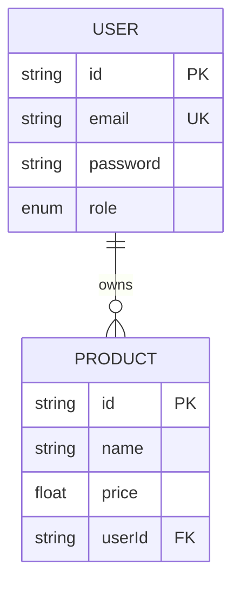

# Database Schema (PostgreSQL)

This project uses PostgreSQL with Prisma ORM.

## Models

### User
| Field | Type | Attributes | Description |
| :--- | :--- | :--- | :--- |
| `id` | `String` | `@id`, `default(uuid())` | Primary Key |
| `email` | `String` | `@unique` | User's email |
| `name` | `String?` | | User's name |
| `password` | `String` | | Hashed password |
| `role` | `Enum (Role)` | `default(USER)` | USER or ADMIN |
| `products` | `Product[]` | | Relation to Products |
| `createdAt` | `DateTime` | `default(now())` | Creation timestamp |
| `updatedAt` | `DateTime` | `@updatedAt` | Last update timestamp |

### Product
| Field | Type | Attributes | Description |
| :--- | :--- | :--- | :--- |
| `id` | `String` | `@id`, `default(uuid())` | Primary Key |
| `name` | `String` | | Product name |
| `description`| `String?` | | Product description |
| `price` | `Float` | | Product price |
| `userId` | `String` | | Foreign Key to User |
| `user` | `User` | | Relation to User |
| `createdAt` | `DateTime` | `default(now())` | Creation timestamp |
| `updatedAt` | `DateTime` | `@updatedAt` | Last update timestamp |

## Enums

### Role
- `USER`
- `ADMIN`

## ER Diagram (Conceptual)

